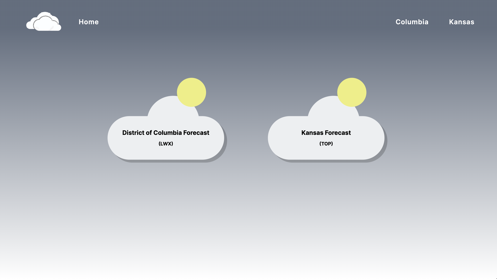
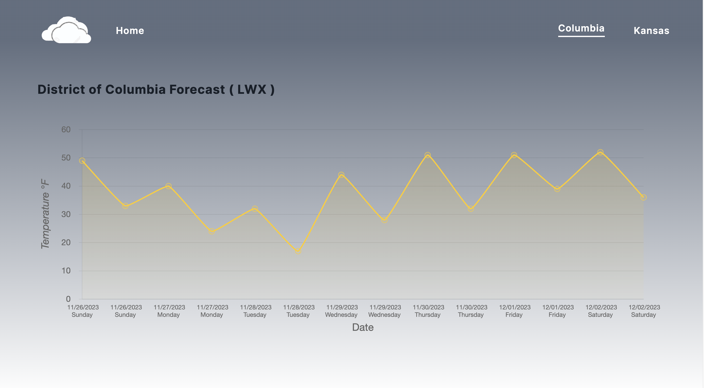
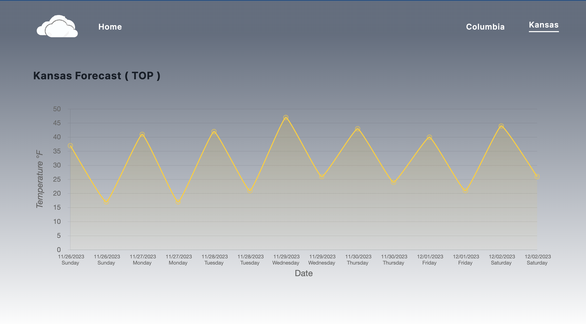

# WeatherApp for Wisy

This project was generated with [Angular CLI](https://github.com/angular/angular-cli) version 15.2.10.

## This project represents a weather app created with angular version 15

1. Use of the Angular framework for react, version 15.
2. The integration of a good architecture of code following the best practices.
3. Creation of reusable components.
4. Use of good CSS strategies to guarantee a good user experience.
5. The website is completely responsive and has been though for mobile devices as well.
6. The project follows the design at high level.

## Deployment

The project has been deployed to this link: [Weather app](https://weather-app-lilac-two-87.vercel.app/home).

## Setup

This project was created using npm to install all the dependencies, in order to run it locally please follow these steps:

1. npm run install

2. npm run start

The development server runs on `http://localhost:4200`

## The pictures below represent a general idea of the project

